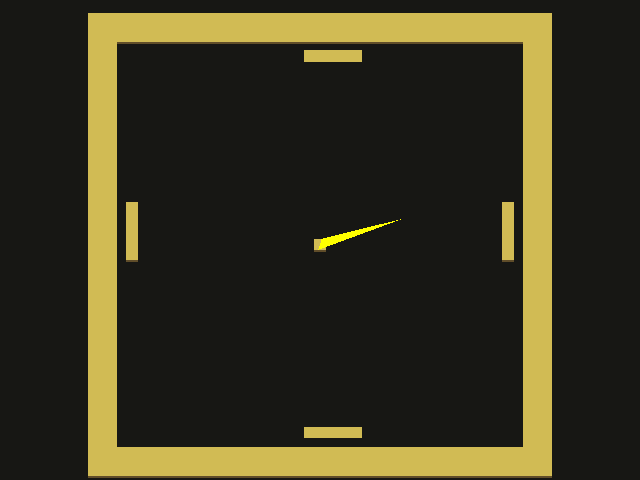

# Pong Escape

Author: Xinyi Sun

Design: Why do we want to hit a pong? What did the pong do to deserve this? Help it escape with the evil paddles on four sides impeding!

Screen Shot:

How To Play:
Use UP and DOWN arrow keys to control the direction in which you want to shoot your pong ball.
Hit SPACE to actually shoot your pong ball.
One of the four sides will be revealed open for escape at some point. Shoot towards that side.
If it escapes successfully, a green check will be shown; if it hits a paddle, a red cross is shown. Game will restart a round with level-up after 3s.

This game was built with [NEST](NEST.md).
